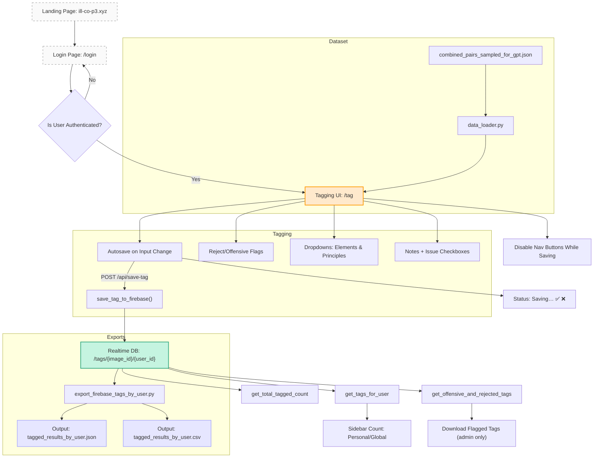

```mermaid
flowchart TD
  %% USER FLOW
  A[Landing Page: ill-co-p3.xyz] --> B[Login Page: /login]
  B --> C{Is User Authenticated?}
  C -- Yes --> D[Tagging UI: /tag]
  C -- No --> B

  %% DATA FLOW
  subgraph Dataset
    E[combined_pairs_sampled_for_gpt.json] --> F[data_loader.py]
    F --> D
  end

  %% TAGGING FLOW
  subgraph Tagging
    D --> G[Autosave on Input Change]
    G -->|POST /api/save-tag| H["save_tag_to_firebase()"]

    D --> I[Reject/Offensive Flags]
    D --> J[Dropdowns: Elements & Principles]
    D --> K[Notes + Issue Checkboxes]
  end

  %% FIREBASE DB
  H --> L["Realtime DB: /tags/{image_id}/{user_id}"]
  L --> M[get_tags_for_user]
  L --> N[get_total_tagged_count]
  L --> O[get_offensive_and_rejected_tags]

  %% EXPORT PATH
  subgraph Exports
    L --> P[export_firebase_tags_by_user.py]
    P --> Q[Output: tagged_results_by_user.json]
    P --> R[Output: tagged_results_by_user.csv]
  end

  %% UI FEEDBACK
  G --> S["Status: Saving… ✅ ❌"]
  D --> T[Disable Nav Buttons While Saving]

  %% ADMIN FEATURES
  M --> U[Sidebar Count: Personal/Global]
  O --> V["Download Flagged Tags (admin only)"]

  %% STYLE
  style D fill:#ffe9cc,stroke:#ff9900,stroke-width:2px
  style L fill:#c5f4e0,stroke:#33a982,stroke-width:2px
  style Q fill:#e6e6ff,stroke:#7d7dff
  style R fill:#e6e6ff,stroke:#7d7dff
  style A fill:#fafafa,stroke:#888,stroke-dasharray: 5
  style B fill:#fafafa,stroke:#888,stroke-dasharray: 5
```